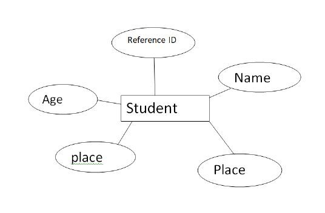
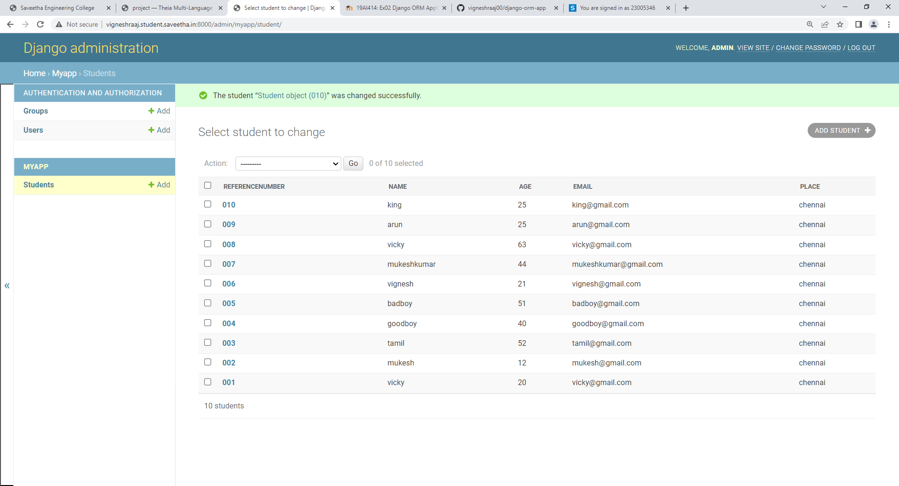
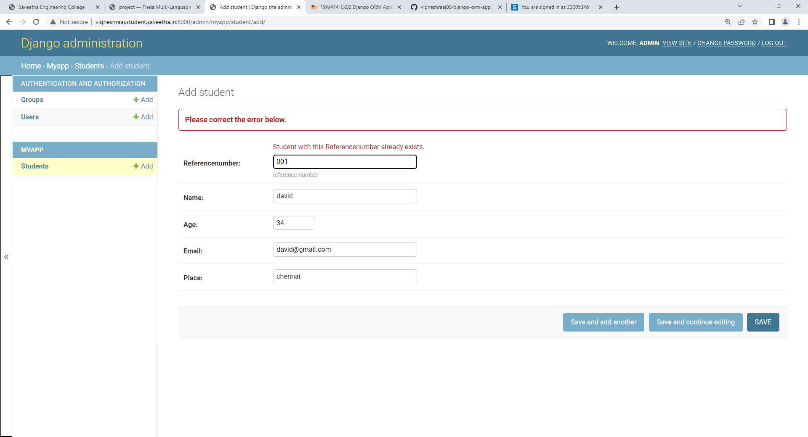

# Django ORM Web Application

## AIM
To develop a Django application to store and retrieve data from a database using Object Relational Mapping(ORM).

## Entity Relationship Diagram

### ER diagram:

## DESIGN STEPS

### STEP 1: createfolder 'ex02' under the directory 'unit2'

### STEP 2:clone the github repository into the directory 'ex02' using the command "git clone <url>"

### STEP 3:under the folder "django-orm-app",enter the directory title "dataproject" and enter the folder "dataproject" and go to the file "setting.py"os"cd

## PROGRAM

### models.py:
from django.db import models
from django.contrib import admin

class student (models.Model):
    referencenumber=models.CharField(max_length=20,help_text="reference number")
    name=models.CharField(max_length=100)
    age=models.IntegerField()
    email=models.EmailField()
    place=models.CharField(max_length=80,default='chennai')

class StudentAdmin(admin.ModelAdmin):
    list_display=('referencenumber','name','age','email','place')

### admin.py:
from django.contrib import admin
from .models import student,StudentAdmin

admin.site.register(student,StudentAdmin)    

## OUTPUT

### database:

### error:

## RESULT:
The program is Executed Successfully.
